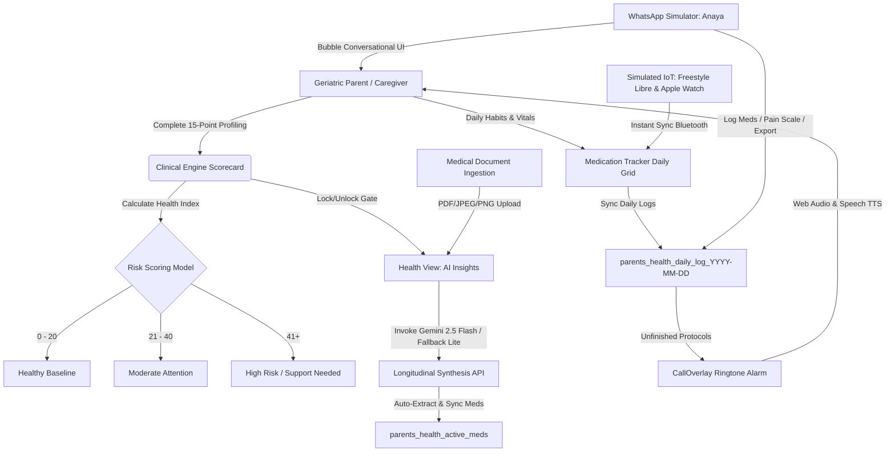

# Sahara Senior (Parents Health OS): The Definitive Product Architectural, Strategic, & Replication Manual
**Version:** 5.0 (The Unified Production-Grade Reference Authority)  
**Status:** Approved for Production Deployment & Replication  
**Principal Architect:** Tharun Gajula  
**Last Updated:** May 25, 2026

---

> [!IMPORTANT]
> **GERIATRIC PATIENT PRIVACY DIRECTIVE (RED-LINE)**
> This application implements a strict zero-server storage model for personal data in the initial prototype, transitioning to India-residency Supabase storage (`ap-south-1` Mumbai) for production in compliance with India's **DPDPA 2023** and **DPDP Rules 2025**. All personal health identifiers (PHIs), clinical scores, medical document analysis summaries, and daily habit logs must remain stored exclusively in the client browser's local storage (`localStorage`) or secure, RLS-protected database buckets. No central tracking pixels or third-party analytical pipelines are permitted to capture patient records.

---

## Technical Concept Blueprint



---

## 1. Core Philosophy, Strategic Moat, and Target User

### 1.1 Executive Identity & Market Wedge
**Parents Health OS** (marketed under the premium brand name **Sahara Senior** or **Sahara Sr.**) is a premium, family-shared eldercare oversight platform. The core strategic wedge is simple but extremely powerful:
*   **Build the product as a WhatsApp-first daughter/son dashboard, NOT as a "senior app".** Top Indian players like Khyaal, Emoha, Anvayaa, and Samarth have proven that 60–75-year-old Indian parents resist installing yet another application. The high-conversion solution is a Hindi/Telugu WhatsApp care companion bot for the parent, a Next.js web/mobile dashboard for the 25–45-year-old adult child, and Google Gemini 2.5 Flash as the translation, transcription, and summarization brain.
*   **"Sahara"** means support/refuge in Hindi-Urdu and is universally understood across Telugu, Tamil, and Kannada, offering an emotionally warm, premium brand voice without being overly clinical.

### 1.2 The Longitudinal Synthesis Layer
Clinical health data only becomes actionable when synthesized with daily, personal routine context. Standard medical dashboards isolate data. They display a blood sugar reading of `160 mg/dL` and flag it as a generic "High Alert," causing unnecessary anxiety. 

Sahara Senior's **Longitudinal Synthesis Layer** cross-references this reading against geriatric profile variables (e.g., a 76-year-old with a high risk of hypoglycemia and balance instability). It understands that for this specific patient, a higher glycemic floor is a deliberate, protective clinical target to prevent sudden syncopes (fainting) and catastrophic falls. The system correlates high-frequency, noisy daily habit logs (medications, water intake, sleep quality, physical activity) with low-frequency, high-validity clinical artifacts (laboratory reports, doctor prescriptions, radiology scans), building an ongoing digital narrative.

### 1.3 The "Sanskaar-UX" Framework
Targeting Indian seniors requires extreme sensitivity to technological friction. Standard UI designs are too clinical, cold, and demanding. Parents Health OS defines the **"Sanskaar-UX" Framework**:
*   **Warm Companion Persona (Anaya):** Uses culturally resonant greetings and speaks in simple, respectful tones. The senior whom we care for is referred to as "Nani" or "Pitaji", while the virtual care companion assistant is named **Anaya**.
*   **Empathetic Explanations (ELI5):** Translates dense clinical jargon into simple, reassuring descriptions in brackets (e.g., *"Creatinine [a natural kidney waste filter level] is stable"*).
*   **Pavlovian Care Loops:** Leverages scheduled automated reminder triggers linked to natural domestic routines (07:00 Morning Tea, 13:00 Lunch, 21:00 Dinner).

### 1.4 North Star Metric: Routine Synchronization Index (RSI)
Rather than tracking raw daily active users or screen engagement, RSI measures the variance between the **Prescribed Clinical Protocol** (medication frequency, vitals thresholds) and the **Actual Daily Logged Adherence**. A higher RSI indicates a more unified, synchronized care timeline.

---

## 2. Complete 15-Point Geriatric Scorecard Database

The **Clinical Assessment Engine** (implemented at `src/components/ClinicalEngine.tsx`) is the foundation of the patient's digital profile. The developer must implement this exact 15-question scorecard without changing any weights or identifiers, as downstream AI prompts and UI state gates rely on these specific records.

### 2.1 The Assessment Protocol Dictionary
The system assesses 10 distinct physiological and environmental categories, accumulating to a maximum possible health index of **175 points**.

| Question ID | Mapped Category | Assessment Question | Option Weights & Score Mapping |
| :--- | :--- | :--- | :--- |
| **q1** | Resilience | How old is the member? | <ul><li>"Below 40" &rarr; **0**</li><li>"40-55" &rarr; **5**</li><li>"56-69" &rarr; **10**</li><li>"70+" &rarr; **15**</li><li>"Don't Know" &rarr; **5**</li></ul> |
| **q2** | Metabolic | Have they been told they have high blood sugar, prediabetes, or diabetes? | <ul><li>"No" &rarr; **0**</li><li>"Prediabetes" &rarr; **5**</li><li>"Diabetes" &rarr; **15**</li><li>"Don't Know" &rarr; **5**</li></ul> |
| **q3** | Cardiovascular | Do they have high BP, Disturbed Cholesterol, or heart issues (stent, bypass, angina)? | <ul><li>"No" &rarr; **0**</li><li>"One Condition" &rarr; **5**</li><li>"Multiple/Severe" &rarr; **15**</li><li>"Don't Know" &rarr; **5**</li></ul> |
| **q4** | Resilience | Do they get tired or breathless doing everyday activities? | <ul><li>"Never" &rarr; **0**</li><li>"Sometimes" &rarr; **5**</li><li>"Often" &rarr; **10**</li><li>"Don't Know" &rarr; **5**</li></ul> |
| **q5** | Cognitive | Have they had stroke, tremors (parkinsonism), limb weakness, or slowed movements? | <ul><li>"No" &rarr; **0**</li><li>"Mild signs" &rarr; **5**</li><li>"Diagnosed/Visible" &rarr; **10**</li><li>"Don't Know" &rarr; **5**</li></ul> |
| **q6** | Cognitive | Do they often seem confused, forgetful, or unsteady? | <ul><li>"No" &rarr; **0**</li><li>"Sometimes" &rarr; **5**</li><li>"Often" &rarr; **10**</li><li>"Don't Know" &rarr; **5**</li></ul> |
| **q7** | Resilience | Have they been hospitalized or undergone major surgery (heart, brain, spine) or cancer? | <ul><li>"No" &rarr; **0**</li><li>"Once/Minor" &rarr; **5**</li><li>"Multiple/Major/Cancer" &rarr; **10**</li><li>"Don't Know" &rarr; **5**</li></ul> |
| **q8** | Muscular | Do they complain of joint/back/knee pain that limits movement? | <ul><li>"No" &rarr; **0**</li><li>"Sometimes/Mild" &rarr; **10**</li><li>"Severe/Daily" &rarr; **20**</li></ul> |
| **q9** | Frailty | Have they had falls or fractures in the last 2 years? | <ul><li>"No" &rarr; **0**</li><li>"Once" &rarr; **5**</li><li>"Multiple" &rarr; **10**</li><li>"Don't Know" &rarr; **5**</li></ul> |
| **q10** | Frailty | Do they need help with stairs, bathing, dressing or getting off the floor? | <ul><li>"No" &rarr; **0**</li><li>"Occasionally" &rarr; **5**</li><li>"Often" &rarr; **10**</li><li>"Don't Know" &rarr; **5**</li></ul> |
| **q11** | Digestive | Do they complain of bloating, acidity, constipation, or gut issues? | <ul><li>"No" &rarr; **0**</li><li>"Occasionally" &rarr; **5**</li><li>"Frequently" &rarr; **10**</li><li>"Don't Know" &rarr; **5**</li></ul> |
| **q12** | Emotional | Do they often seem stressed, anxious, or emotionally low? | <ul><li>"No" &rarr; **0**</li><li>"Sometimes" &rarr; **5**</li><li>"Often" &rarr; **10**</li><li>"Don't Know" &rarr; **5**</li></ul> |
| **q13** | Sleep | Do they sleep poorly, snore loudly or nap excessively? | <ul><li>"Good/No" &rarr; **0**</li><li>"Sometimes" &rarr; **5**</li><li>"Often/Poor" &rarr; **10**</li><li>"Don't Know" &rarr; **5**</li></ul> |
| **q14** | Lifestyle | Do they usually eat unhealthy foods, eat at odd times, or drink too little water? | <ul><li>"No" &rarr; **0**</li><li>"Sometimes" &rarr; **5**</li><li>"Often" &rarr; **10**</li><li>"Don't Know" &rarr; **5**</li></ul> |
| **q15** | Lifestyle | Do they smoke, drink often or avoid exercise completely? | <ul><li>"None" &rarr; **0**</li><li>"One habit" &rarr; **5**</li><li>"Two or more" &rarr; **10**</li><li>"Don't Know" &rarr; **5**</li></ul> |

### 2.2 Category Score Aggregation Formulas
Each answered question contributes a score that maps into specific categories. The scoring parameters are computed dynamically using `useMemo`:

```typescript
const scores = useMemo(() => {
    const getScore = (qId: string) => {
        const selectedLabel = answers[qId];
        if (!selectedLabel) return 0;
        const question = QUESTIONS.find(q => q.id === qId);
        const option = question?.options.find(opt => opt.label === selectedLabel);
        return option?.score || 0;
    };

    const categories = [
        { name: "Metabolic",      score: getScore("q2"), max: 15 },
        { name: "Cardiovascular", score: getScore("q3"), max: 15 },
        { name: "Cognitive",      score: getScore("q5") + getScore("q6"), max: 20 },
        { name: "Muscular",       score: getScore("q8"), max: 20 },
        { name: "Frailty",        score: getScore("q9") + getScore("q10"), max: 20 },
        { name: "Digestive",      score: getScore("q11"), max: 10 },
        { name: "Emotional",      score: getScore("q12"), max: 10 },
        { name: "Sleep",          score: getScore("q13"), max: 10 },
        { name: "Lifestyle",      score: getScore("q14") + getScore("q15"), max: 20 },
        { name: "Resilience",     score: getScore("q1") + getScore("q4") + getScore("q7"), max: 35 },
    ];

    const total = categories.reduce((sum, cat) => sum + cat.score, 0);

    // Classification Rules
    let riskLevel = "Healthy Baseline";
    if (total > 40) {
        riskLevel = "High Risk: Immediate Action Required";
    } else if (total > 20) {
        riskLevel = "Moderate Attention";
    }

    return { categories, total, riskLevel };
}, [answers]);
```

### 2.3 Score Classifications
*   **0 - 20 (Healthy Baseline):** High baseline resilience. Suggest routine physical monitoring.
*   **21 - 40 (Moderate Attention):** Early signs of functional vulnerability. Recommends a bi-weekly review of lifestyle habits and medication schedules.
*   **41+ (High Risk / Support Needed):** Clear indications of physiological frailty. Unlocks intensive daily care companion logs and triggers reminders if entries are skipped. (LASI baseline statistics note that 32% of Indian elders aged 60+ have diagnosed hypertension, 14% have diabetes, and 19% have chronic bone/joint disease).

---

## 3. WhatsApp Messaging Simulation & Meta Cloud API Onboarding

To support seniors using familiar tools, the messaging hub (`src/components/WhatsAppDemo.tsx`) simulates a live conversation with **Anaya**, the virtual care companion.

### 3.1 WhatsApp Onboarding Flow (Meta Cloud API, Direct)
1.  **Meta Business Manager:** Create a Business Account (`business.facebook.com`). Match legal entity credentials.
2.  **Meta Business Verification:** Upload Certificate of Incorporation or GST certificate.
3.  **WABA Creation:** Choose **INR** as the billing currency at WABA creation (this cannot be changed later).
4.  **Phone Number Registration:** Register a new number not associated with a personal WhatsApp account.
5.  **Access Token:** Generate a permanent System User access token and store in Vercel environment variables.
6.  **Webhook Setup:** Point Meta's webhook to `https://your-domain.com/api/wa/webhook`.

### 3.2 Pricing Math (India, INR, 2026 rates)
Meta's billing model operates on per-message category fees:
*   **Service Messages (Customer-Initiated):** **Free** within a 24-hour response window.
*   **Utility Templates (Reminders, Summaries):** **~₹0.115–₹0.13** per delivered message.
*   **Authentication Templates (OTPs):** **~₹0.115–₹0.13** per message.
*   **Marketing Templates (Promo/New features):** **~₹0.86–₹0.88** per message (Meta increased Indian marketing message rates by 10% on Jan 1, 2026).

**Estimated Monthly WhatsApp Cost for 100 Families:**
*   100 parents × 5 daily utility messages × 30 days = 15,000 messages.
*   Since the majority of parents respond within the 24-hour service window, billable templates average 4,000–6,000/month.
*   4,000 × ₹0.13 = ₹520 + GST = **~₹700–₹2,500/month** total operating cost.

### 3.3 Interactive Dialog Flow
*   **Incoming Voice Notes:** WhatsApp Cloud API webhook delivers a `media.id`. Fetch via `GET /v18.0/{media-id}`, download the Presigned URL, and feed the binary bytes (`audio/ogg; codecs=opus`) to Gemini 2.5 Flash for transcription and translation.
*   **Outgoing Voice Notes:** Upload native synthesized Speech TTS audio (`audio/ogg`) to Meta media endpoints, then dispatch as `{ type: "audio", audio: { id } }` to render with clean play/pause wave controls.
*   **Actionable Templates:**
    *   *Reminders:* "Namaste Ji, {{1}} ki goli ka samay ho gaya hai. Le li ho toh niche tap karein."
    *   *Quick Replies:* [Taken ✅] | [Snooze 30m ⏰]
    *   *Contextual Triggers:* Tapping "Taken ✅" records medication completion, updates client memory, and triggers the follow-up pain tracking loop: *"How is your knee pain today on a scale of 1-10?"*

---

## 4. The Longitudinal Synthesis API & Fallback Routing

To synthesize clinical contexts and analyze documents, Sahara Senior routes requests to a single dynamic Next.js API endpoint: `/api/analyze/route.ts`. The implementation supports two processing workflows: **Holistic Summary Synthesis** and **Multimodal Document Analysis**, with a robust automated model fallback.

### 4.1 Next.js API Route Architecture (`src/app/api/analyze/route.ts`)
```typescript
import { GoogleGenerativeAI } from "@google/generative-ai";
import { NextResponse } from "next/server";

const genAI = new GoogleGenerativeAI(process.env.NEXT_PUBLIC_GEMINI_API_KEY || "");

export const maxDuration = 60; // Max execution time for API functions
export const dynamic = 'force-dynamic';

export async function POST(req: Request) {
  try {
    const formData = await req.formData();
    const file = formData.get("file") as File;
    const clinicalContext = formData.get("clinicalContext") as string || "No clinical profile available.";
    const historyContext = formData.get("historyContext") as string || "No previous reports.";
    const mode = formData.get("mode") as string;

    // ==========================================
    // WORKFLOW 1: HOLISTIC SUMMARY SYNTHESIS
    // ==========================================
    if (mode === "summary") {
       let modelString = "gemini-2.5-flash"; 
       let model = genAI.getGenerativeModel({ model: modelString });
       
       const summaryPrompt = `You are "Parents Health AI" (Anaya's Dashboard Brain), a senior medical data analyst.
       
       OBJECTIVE: Generate a "Holistic Health Summary" for an Indian elder based on their Clinical Profile and Report History.
       
       TONE: 
       - Beginner Friendly (Explain simple medical terms in brackets).
       - Reassuring but Objective.
       - Use Simple English (ELI5 style).
       
       INPUTS:
       1. Clinical Profile (Assessment Scores & Answers):
       ${clinicalContext}
       
       2. Report History (Past Lab/Rx Analysis):
       ${historyContext}
       
       TASKS:
       1. **Synthesize:** Combine the clinical profile risks with findings from the report history.
       2. **Filter Noise:** Ignore reports that seem completely unrelated.
       3. **Connect the Dots:** Highlight how reports confirm or contradict clinical assessment scores.
       
       OUTPUT FORMAT (JSON):
       \`\`\`json
       {
         "title": "Holistic Health Summary",
         "patientRiskProfile": "Summary of their risk level (e.g. 'High Risk Diabetic')",
         "keyFindings": [
           "**Finding 1**: Explanation in simple english.",
           "**Finding 2**: Another finding."
         ],
         "trendAnalysis": "A nicely spaced paragraph describing the health trajectory. Use bold text for emphasis.",
         "recommendation": "One clear, high-level medical recommendation based on the synthesis."
       }
       \`\`\`
       `;

       let result;
       try {
           result = await model.generateContent(summaryPrompt);
       } catch (error: any) {
           console.warn(`Summary with ${modelString} failed: ${error.message}. Fallback to gemini-2.5-flash-lite.`);
           modelString = "gemini-2.5-flash-lite";
           model = genAI.getGenerativeModel({ model: modelString });
           result = await model.generateContent(summaryPrompt);
       }

       const text = result.response.text();
       let jsonString = cleanJsonResponse(text);
       
       try {
           return NextResponse.json({ result: JSON.parse(jsonString), modelUsed: modelString });
       } catch (e) {
           return NextResponse.json({ error: "Failed to parse Summary JSON", raw: text }, { status: 500 });
       }
    }

    // ==========================================
    // WORKFLOW 2: MULTIMODAL DOCUMENT ANALYSIS
    // ==========================================
    if (!file) {
      return NextResponse.json({ error: "No file provided" }, { status: 400 });
    }

    const arrayBuffer = await file.arrayBuffer();
    const buffer = Buffer.from(arrayBuffer);
    const base64Data = buffer.toString("base64");
    const mimeType = file.type || "image/png";

    let modelString = "gemini-2.5-flash"; 
    let model = genAI.getGenerativeModel({ model: modelString });

    const prompt = `You are "Parents Health AI" (Anaya's Multimodal Brain), an automated health data analyst.
    Your Tone: Empathetic, Reassuring, Beginner-Friendly (Explain medical terms in brackets).
    
    Patient Clinical Context (Profile):
    ${clinicalContext}

    Medical History (Past Reports Summary):
    ${historyContext}

    TASKS:
    1.  **Classify:** Is this a "Lab Report", "Prescription", or "Scan"?
    2.  **Analyze (Deep Read):** Read every single page. Extract all abnormal values.
    3.  **Explain:** For every abnormal finding, explain WHAT it means in simple English.
    4.  **Medicines:** Extract detailed medicine info.
        -   **Type:** "Chronic" (Long-term) OR "Acute" (Short-term).
        -   **Duration:** Look for keywords like "for 5 days", "1 month". Default to "Ongoing" if Chronic.
    5.  **Context:** Connect findings to the Patient Clinical Profile.
    
    CRITICAL: Output must be in strict JSON format.
    
    \`\`\`json
    {
      "meta": { "reportDate": "YYYY-MM-DD", "reportType": "Lab/Rx/Scan", "pageCount": "estimated pages" },
      "summary": "High-level summary in simple, non-jargon language.",
      "clinicalCorrelation": "How this report relates to the patient's history (e.g. 'This confirms the diabetes risk').",
      "biomarkers": [
          { "name": "Test Name", "value": "120", "unit": "mg/dL", "status": "High/Low/Normal", "trend": "Rising/Falling/Stable/New" }
      ],
      "analysis": "Detailed findings in MARKDOWN. Use bullet points, **Bold** text, and short paragraphs. Explain complex terms.",
      "medicines": [ 
        { 
          "name": "Augmentin 625", 
          "type": "Acute", 
          "strength": "625mg", 
          "dosage": "1 tablet twice daily", 
          "timing": "After food",
          "duration": "5 days"
        },
        { 
          "name": "Glycomet", 
          "type": "Chronic", 
          "strength": "500mg", 
          "dosage": "1 tablet daily", 
          "timing": "Before food",
          "duration": "Ongoing"
        } 
      ],
      "disclaimer": "Generated by AI. Verify with a specialist."
    }
    \`\`\`
    `;

    const analyzeImage = async (selectedModel: any) => {
        return await selectedModel.generateContent([
            prompt,
            {
              inlineData: {
                data: base64Data,
                mimeType: mimeType,
              },
            },
        ]);
    };

    let result;
    try {
        result = await analyzeImage(model);
    } catch (modelError: any) {
        console.warn(`Primary model ${modelString} failed (${modelError.message}), fallback to gemini-2.5-flash-lite`);
        modelString = "gemini-2.5-flash-lite";
        model = genAI.getGenerativeModel({ model: modelString });
        result = await analyzeImage(model);
    }

    const responseText = result.response.text();
    let jsonString = cleanJsonResponse(responseText);
    
    let parsedResult;
    try {
        parsedResult = JSON.parse(jsonString);
    } catch (e) {
        console.error("Failed to parse JSON from AI", responseText);
        try {
            const sanitized = jsonString.replace(/\n/g, "\\n");
            parsedResult = JSON.parse(sanitized);
        } catch (e2) {
             parsedResult = {
                docType: "Unknown",
                summary: "Analysis completed but format was unstructured.",
                analysis: responseText,
                medicines: [],
                disclaimer: "AI Parsing Error. Raw output shown."
            };
        }
    }

    return NextResponse.json({ result: parsedResult, modelUsed: modelString });

  } catch (error: any) {
    console.error("Parents Health AI Analysis Error:", error);
    return NextResponse.json({ error: "Failed to analyze the report.", details: error.message || String(error) }, { status: 500 });
  }
}

function cleanJsonResponse(text: string): string {
    const codeBlockMatch = /```(?:json)?\s*([\s\S]*?)\s*```/i.exec(text);
    if (codeBlockMatch) {
        return codeBlockMatch[1];
    }
    const firstBrace = text.indexOf('{');
    const lastBrace = text.lastIndexOf('}');
    if (firstBrace !== -1 && lastBrace !== -1) {
        return text.substring(firstBrace, lastBrace + 1);
    }
    return text;
}
```

### 4.2 Automated Fallback Routing
*   **Primary Engine:** `gemini-2.5-flash` handles standard ingestion. It features deep multilingual alignment, multimodal capabilities, and a 1M token context.
*   **Secondary Engine:** `gemini-2.5-flash-lite`. Operates as the robust fallback model for immediate failover during rate limits.
*   **PII Directive:** For unpaid prototype/free-tier accounts, all parent PII must be stripped client-side prior to Gemini transmission. Pinned billing paid Tier 1 accounts do not use inputs for model training, satisfying enterprise privacy guidelines.

---

## 5. Daily Care Routine, Checklist, and Simulated IoT

### 5.1 Adherence Checklist Engine
Located in `src/components/MedicationTracker.tsx`, the daily checklist tracks logs in real-time, mapping medications against scheduled hours:
```typescript
const toggleMed = (medName: string) => {
    const isTaken = activeLog.meds.includes(medName);
    let newMedsList = isTaken
        ? activeLog.meds.filter(m => m !== medName)
        : [...activeLog.meds, medName];
    
    const newLog = { ...activeLog, meds: newMedsList };
    saveLog(viewingDate, newLog);
};
```

### 5.2 History Calendar Matrix
Renders a grid mapping monthly compliance:
*   **Green Circle/Surface (`bg-cyan-500/20 text-cyan-400`):** Perfect adherence. All active medications are checked, and vitals are logged.
*   **Amber Circle/Surface (`bg-amber-500/20 text-amber-400`):** Partial completion. Some entries or vitals are missing.
*   **Red Circle/Surface (`bg-red-500/10 text-red-500`):** Incomplete log. Nothing recorded.

### 5.3 Simulated Bluetooth IoT Core
Simplifies elder inputs via mocked Bluetooth device connections:
*   **FreeStyle Libre 3 (CGM):** Simulates standard reading sync, outputting a safe metabolic level of **110 mg/dL** directly to dashboard states. Displays a toast notification: `⚡ Synced 110 mg/dL from Freestyle Libre`.
*   **Apple Watch Ultra 2:** Automatically syncs a weight of **64.5 kg** and logs **45 minutes** of active exercise, displaying a blue confirmation toast.
*   **Omron X7 Smart BP Monitor:** Setup as a mock pairing placeholder card with a dashed border to denote future integration.

---

## 6. Web Audio Ringtone Oscillator System

When compliance runs past threshold times, the call overlay module (`src/components/CallOverlay.tsx`) activates, utilizing the browser's native Web Audio API to trigger a high-frequency acoustic alert without relying on external file assets.

### 6.1 Web Audio Dual-Tone Oscillator
```typescript
const playRingtone = () => {
    if (!audioCtxRef.current) {
        audioCtxRef.current = new (window.AudioContext || (window as any).webkitAudioContext)();
    }
    const ctx = audioCtxRef.current;
    const osc = ctx.createOscillator();
    const gain = ctx.createGain();

    osc.type = "sine";
    // Dual-tone high-priority shift
    osc.frequency.setValueAtTime(440, ctx.currentTime); 
    osc.frequency.setValueAtTime(554.37, ctx.currentTime + 0.2); 

    // Pulse Envelope configurations
    gain.gain.setValueAtTime(0, ctx.currentTime);
    gain.gain.linearRampToValueAtTime(0.5, ctx.currentTime + 0.1);
    gain.gain.linearRampToValueAtTime(0, ctx.currentTime + 0.4);
    gain.gain.setValueAtTime(0, ctx.currentTime + 0.6);
    gain.gain.linearRampToValueAtTime(0.5, ctx.currentTime + 0.7);
    gain.gain.linearRampToValueAtTime(0, ctx.currentTime + 1.0);

    osc.connect(gain);
    gain.connect(ctx.destination);

    osc.start();
    oscillatorRef.current = osc;
};
```

### 6.2 SpeechSynthesis Voice TTS
Upon call pick-up, the ringtone halts, and the browser's TTS system delivers an automated companion nudge:
*   **Message:** `"Namaste. Please take your scheduled medicines."`
*   **Speech Velocity:** Set to `0.9` (slowed down for clear comprehension).
*   **Automatic Transition:** Timed for 5 seconds of active duration before returning the senior back to the dashboard layout.

---

## 7. Clinical Operations & Support Infrastructure

### 7.1 Financial Transactions: Praan Wallet
Mock transactional engine positioned at `src/components/ClinicHub.tsx`:
*   **Initial Balance:** Initialized at ₹1,250.
*   **Actionable Logs:** Simulates deducting credits to schedule teleconsultation sessions with specialized geriatric care professionals.

### 7.2 Insurance Coverage: Senior Shield
Standard coverage policy representation:
*   **Policy ID:** `YUK-8829-X`.
*   **Visual Interface:** Explains co-pays, deductibles, and supported clinical facilities.

### 7.3 Multi-Channel Care Team Specialist Guild
1.  **Anaya:** Virtual care companion assistant.
2.  **Dr. Aruna Desai (Geriatric Specialist):** Oversees medical reviews and checks weekly pain logs.
3.  **Ms. Sanya Kapoor (Dietitian):** Focuses on low-glycemic, cardiac-healthy diets.
4.  **Coach Vikram Singh (Physiotherapist):** Mobility routines and fall-prevention exercises.
5.  **Amit Verma (Support Ops):** Logistics coordinator.
6.  **Dr. Esha Sethi (Sleep Practitioner):** Nighttime breathing profiles and sleep quality tracking.

---

## 8. Client-Side Local Storage Schema Registry

| Local Storage Key | Data Type | Default Value | JSON Schema / Data Shape Example |
| :--- | :--- | :--- | :--- |
| `parents_health_auth_v2` | `boolean` | `true` | `true` |
| `parents_health_user_name` | `string` | `"Nani"` | `"Nani"` (Refers to the parent; the assistant is named Anaya) |
| `parents_health_assessment_data_v2` | `object` | `null` | ```json<br>{<br>  "answers": {<br>    "q1": "70+",<br>    "q2": "Diabetes"<br>  },<br>  "scores": {<br>    "total": 30,<br>    "riskLevel": "Moderate Attention"<br>  }<br>}<br>``` |
| `parents_health_active_meds` | `array` | `[]` | ```json<br>[<br>  {<br>    "name": "Glycomet",<br>    "dosage": "500mg",<br>    "timing": "After Food",<br>    "type": "Chronic",<br>    "status": "Active",<br>    "startDate": "2026-04-17"<br>  }<br>]<br>``` |
| `parents_health_history` | `array` | `[]` | ```json<br>[<br>  {<br>    "meta": {<br>      "reportDate": "2026-04-17",<br>      "reportType": "Lab Report"<br>    },<br>    "summary": "Blood sugar has stabilized.",<br>    "biomarkers": [<br>      { "name": "HbA1c", "value": "6.8", "status": "Normal" }<br>    ],<br>    "analysis": "Markdown analysis text..."<br>  }<br>]<br>``` |
| `parents_health_latest_summary` | `object` | `null` | ```json<br>{<br>  "title": "Holistic Health Summary",<br>  "patientRiskProfile": "Moderate Attention Diabetic",<br>  "keyFindings": ["Finding 1"],<br>  "trendAnalysis": "Trajectory text...",<br>  "recommendation": "Recommendation text..."<br>}<br>``` |
| `parents_health_daily_log_YYYY-MM-DD` | `object` | `null` | ```json<br>{<br>  "meds": ["Glycomet"],<br>  "vitals": {<br>    "bpSys": 120,<br>    "bpDia": 80,<br>    "sugar": 110,<br>    "weight": 64.5<br>  },<br>  "habits": {<br>    "mealPlan": true,<br>    "activity": 45,<br>    "hydration": 8<br>  }<br>}<br>``` |

---

## 9. Design System: Calming Warm Healthcare Theme

To deliver an exceptional visual style, the user interface shifts away from cold, dark tech HUD elements toward a premium, warm clinical aesthetic suitable for Indian families.

### 9.1 Foundational Variables (`src/app/globals.css`)
*   **Off-White Cream Background:** `#FAF9F6`
*   **Primary Text (Forest Charcoal):** `#122321`
*   **Primary Accent (Deep Trust Teal):** `#0E5E5A`
*   **Highlight Accent (Warm Amber / Saffron):** `#E05E1B`

### 9.2 Tailwind Color Mapping Override
In Tailwind configurations, default styles are mapped directly using the `@theme` directive inside `src/app/globals.css`:
```css
@theme {
  --color-slate-950: #FAF9F6;
  --color-slate-900: #122321;
  --color-slate-800: #1c3330;
  --color-slate-700: #294642;
  --color-slate-600: #3f625d;
  --color-slate-500: #557d77;
  --color-slate-400: #7b9c97;
  --color-slate-300: #a9bfbc;
  --color-slate-200: #d6e2e0;
  --color-slate-100: #e2ded5;
  --color-cyan-400: #E05E1B;
  --color-cyan-500: #0E5E5A;
  --color-cyan-600: #0C4E4B;
}
```

### 9.3 Custom Glassmorphic Cards & Controls
```css
.glass-card {
  background: #ffffff !important;
  backdrop-filter: blur(8px) !important;
  border: 1px solid #e2ded5 !important;
  box-shadow: 0 10px 30px rgba(18, 35, 33, 0.03) !important;
}

input, textarea, select {
  background-color: #FAF9F6 !important;
  border: 1px solid #e2ded5 !important;
  color: #122321 !important;
}

input:focus, textarea:focus, select:focus {
  border-color: #0E5E5A !important;
  box-shadow: 0 0 0 2px rgba(14, 94, 90, 0.1) !important;
}

/* Syntactically valid escaped class names for Next.js/Tailwind compiler */
.bg-\[\#0E5E5A\] .text-white,
.bg-\[\#E05E1B\] .text-white {
  color: #ffffff !important;
}
```

### 9.4 Visual QA & Production Design Stabilization Pass (May 2026)
During the conversion from a dark-themed tech prototype to the premium, high-contrast warm clinical theme, several visual QA corrections were implemented to eliminate overlapping text, white-on-white text clipping, and misaligned panels:
1. **Dynamic Theme Overrides:** Old `bg-slate-950` and `bg-slate-900` styles from the dark-themed skeleton were globally mapped to high-contrast `#ffffff` and `#FAF9F6` backgrounds. Any text element matching these containers was forced to deep forest charcoal (`#122321`) to maintain perfect WCAG accessibility levels.
2. **Profile & Notification Overlays:** Standardized the Header widgets. Interactive dropdown menus (such as user profiles and system notifications) are styled with explicit light card backgrounds, rich `#122321` text labels, and clean `#e2ded5` borders to prevent overlapping icons.
3. **Modal Form Refactoring:** In components like `ClinicHub.tsx`, hardcoded overlay overrides are avoided by utilizing a distinct `bg-black/65` backdrop, while form cards are styled as explicit light panels (`bg-white`) containing soft input backgrounds (`bg-slate-50`), deep charcoal text, and brand-aligned forest teal (`#0E5E5A`) accents.
4. **Cohesive Color Accents:** Unified clinical status buttons, tracker checklists, active tabs, and specialist badges to render using either deep trust teal (`#0E5E5A`) or saffron amber (`#E05E1B`), achieving a perfect visual rhythm across both mobile and desktop viewports.

---

## 10. Privacy & Compliance — DPDPA 2023 / DPDP Rules 2025

Health records constitute sensitive personal data under India's **DPDPA 2023** and **DPDP Rules 2025** framework. 

### 10.1 Key Directives for Sahara Senior
1.  **Strict Consent Ledger:** Every customer signup must log explicit, granular consent inside the `consents` table (storing timestamp, IP address, consent version, and locale).
2.  **Verifiable Consent:** In cases of severe cognitive impairment (e.g. advanced dementia), the platform requires lawful guardianship documentation to be uploaded, making the child the primary authorized Data Principal.
3.  **Data Residency:** Pin all Supabase instances to India's `ap-south-1` Mumbai region.
4.  **No Bundling:** Keep checkboxes for service delivery, marketing, and AI processing completely separate.
5.  **Right to Erasure:** Typing "STOP" on WhatsApp or clicking "Delete Account" on the dashboard must trigger a soft-deletion within 48 hours and a complete database purge within 30 days.

---

## 11. Foolproof Step-by-Step 90-Day Build & Replication Roadmap

This section outlines the build steps required to replicate this application from scratch.

### Step 1: Initialize Next.js Workspace
Run the setup script inside an empty folder:
```powershell
npx -y create-next-app@latest parents-health-os --typescript --tailwind --app --src-dir --import-alias "@/*" --use-npm
cd parents-health-os
```

### Step 2: Install Core Ingestion Packages
```powershell
npm install @google/generative-ai lucide-react framer-motion react-dropzone react-markdown
```

### Step 3: Write Configuration Files
Initialize a `.env.local` file in the root folder containing:
```env
NEXT_PUBLIC_GEMINI_API_KEY=your_gemini_api_key_here
```

### Step 4: Configure Global Design Overrides
Replace the contents of `src/app/globals.css` with the CSS definitions detailed in **Section 9**.

### Step 5: Implement the Longitudinal Ingestion API
Create the path `src/app/api/analyze/route.ts` and paste the complete route logic detailed in **Section 4.1**.

### Step 6: Assemble Core Components
Recreate the components inside `src/components/` following these layout boundaries:
1.  **Clinical Assessment (`src/components/ClinicalEngine.tsx`):** Map the 15 questions and category parameters from **Section 2**.
2.  **WhatsApp Simulator Chat (`src/components/WhatsAppDemo.tsx`):** Build the dialog chains, pain-tracking nodes, and styling parameters matching **Section 3**.
3.  **Medication Checklists (`src/components/MedicationTracker.tsx`):** Set up daily time slots and hook up Freestyle Libre and Apple Health mock sync toggles from **Section 5**.
4.  **Audio Oscillator Call Ringing (`src/components/CallOverlay.tsx`):** Implement the twin-frequency oscillator loop and custom slowed Speech TTS prompt detailed in **Section 6**.
5.  **Document Upload & OCR parser (`src/components/SmartReport.tsx`):** Set up drag-and-drop zones, handle base64 image encoding, fetch responses from `/api/analyze`, and execute clean medication merges into client storage.

### 90-Day Sprint Calendar Execution (Free-tier to Production Scaling)
*   **Sprint 0 (Week 1):** Buy domains (`saharasenior.com`), set up Meta WABA, verify corporate entity, set up database tables in `ap-south-1`.
*   **Sprint 1-2 (Weeks 2-3):** Build child auth (OTP via WhatsApp template), configure consent ledger tables, and initialize local storage synchronization.
*   **Sprint 3 (Week 4):** Connect Meta webhook to Next.js API, configure webhook media signature checking, and verify message routing.
*   **Sprint 4-5 (Weeks 5-6):** Integrate Gemini Flash transcription, build multilingual TTS voice synthesis templates, and trace token usage costs.
*   **Sprint 6 (Week 7):** Implement progressive Katz ADL and GDS-15 scoring protocols over WhatsApp dialog prompts.
*   **Sprint 7-8 (Weeks 8-9):** Build the minimal doctor workspace for consult reviews and prescription PDF generation.
*   **Sprint 9 (Weeks 10-11):** Launch initial hand-held beta testing with 10 families, monitoring the WhatsApp quality rating.
*   **Sprint 10-12 (Weeks 12-13):** Scale up to 100 families, activate paid tiers for Vercel, Supabase, and Gemini to ensure robust data residency compliance, and begin processing subscriptions.

---
*End of Blueprint. This document serves as the absolute master authority for Parents Health OS & Sahara Senior replication.*
